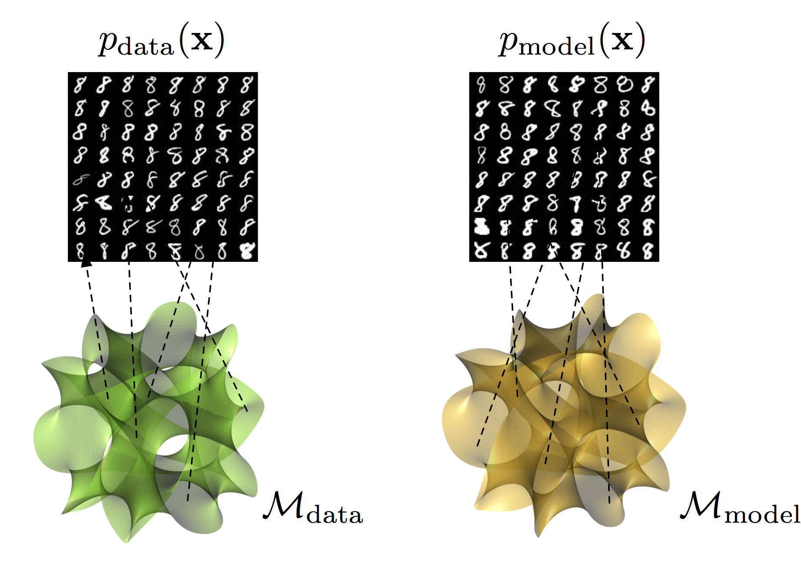

# Geometry Score: A Method For Evaluating Generative Adversarial Networks
Python implementation of the algorithms from the paper.

## Prerequisites

- Python 2.7 or Python 3.3+
- [SciPy](http://www.scipy.org/install.html)
- [NumPy](http://www.numpy.org/)
- [matplotlib](https://matplotlib.org/users/installing.html)
- [GUDHI](http://gudhi.gforge.inria.fr/python/latest/installation.html)
- [Cython](http://cython.org/)

## Basic usage
```python
import numpy as np
import gs
X = np.random.rand(1000, 32)
mrlt = gs.rlts(X, L_0=64, gamma=1.0/128, i_max=100, n=100)
```
For more details see [examples](https://github.com/geom-score/geometry-score/blob/master/examples.ipynb).

If you want to apply it to visual data you first have to reshape it into 2D array.
